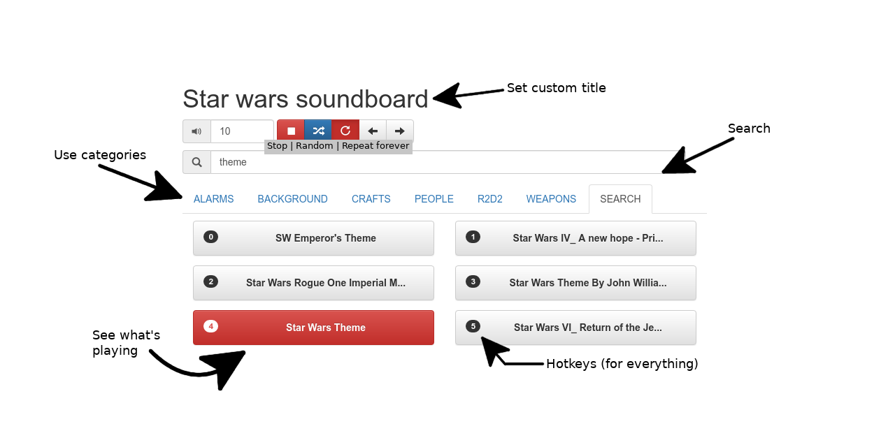

# PnP Soundboard using Web Audio API

## Description
This soundboard offers the following features:

* Search
* Dynamic hotkeys (up to 61 buttons per category)
* Volume regulation
* Categories
* Easy to customize
* Can be used with keyboard only
* Works OS independent

My focus of this board is to be able to play sounds during pen and paper as quickly as possible
without being distracted because I have to search manually for the right sound.

This soundboard originated from [mlg-soundboard](https://github.com/tst/mlg-soundboard) and it
still uses the Web Sound API. 

## Installation

1. Pull this Repo
2. Run `npm install` to install the local dependencies

## Usage

1. Add sounds into `./sounds/$category/$sound_title.mp3`
2. Run `npm start` to spin up the server (a browser window opens automatically)

I've tested it on Firefox 67 (current version) and Chrome 74 (current) and will work likely for
future version.

## Thanks

* Thanks to [tst](https://github.com/tst) and all that helped him developing the [MLG Soundboard](https://github.com/tst/mlg-soundboard)

## Requests / Questions

If you have any questions or requests open an issue or shout really really loud out your window.

## The local server

The soundboard uses [live-server](https://www.npmjs.com/package/live-server), as it automatically
reloads the soundboard on file changes and automatically opens a window when spinning it up.

## Update sounds

Put all sounds in sub directories in the `sounds` directory. The sub directories are used as sub
categories. If the category is switched the short cuts will be remapped on the category you are
viewing. The sound structure will be updated every time you run `npm start`. That said the sounds
directory has the following structure `./sounds/${category name}/${sound title}.mp3`

### What filetypes are supported?

All audio files that can be played in your browser.
You can see the supported HTML5 audio formats [here](https://en.wikipedia.org/wiki/HTML5_audio#Supported_audio_coding_formats).

That said "mp4" has only worked with the corresponding audio extension `m4a`.

The following audio types have *not* worked with the current chrome version on Linux:

* AIFF
* AMR
* WMA <-- Probably missing codecs on my side

The following types have worked:

* AAC
* FLAC
* M4A
* MP3
* OGG
* WAV
* WEBM

### Where to get sounds?

Using [youtube-dl](https://ytdl-org.github.io/youtube-dl/) to get sounds from all [supported](https://ytdl-org.github.io/youtube-dl/supportedsites.html) streaming sides by using the command `youtube-dl -f 'bestaudio' $URL`.

From [soundboard](https://www.soundboard.com/) using [soundboard_dl](https://github.com/jlis/soundboard_dl) to download them via `php dl.php $sound_board_title`..

Alternatively make your own sounds :)

## Use your own title

By running `npm start` the `js/example.customisations.json` will be copied to `js/customisations.json`,
which you can edit to set the title of your soundboard.

## Search through titles

You can now search through every category. You can focus the field by pressing `space`. Your
results will can be seen under the search tab. All hotkeys will be remapped on your search
results when viewing them.

## Hotkeys

Use `alt` to focus the search field.

Use `shift` to play a random tile from the currently chosen tab.

Use `backspace` or `escape` to stop all playing titles.

Use `arrow left` or `arrow right` to go to the next or previous tab.

Use `arrow up` or `arrow down` to increase or decrease the volume.

Use `control` to toggle the repeat next sound button.

Use the key presented on the buttons to trigger the button.

All hotkeys are deactivated if you are typing in an input field.

After you have clicked some button you can use the hotkeys of your
browser to trigger the button again by hitting `space` or `enter`.

## Unit tests

Unit tests can be run through running `npm test`. The test are run by the
[JEST testing framework](https://jestjs.io/). As the code itself is written in vanilla JS the
imports of the files into the test suite look kind of hacky. If you know any better way,
please submit a PR to change it :)
